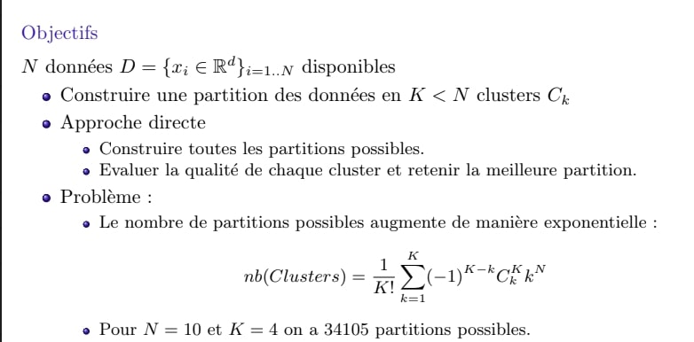
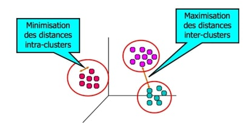
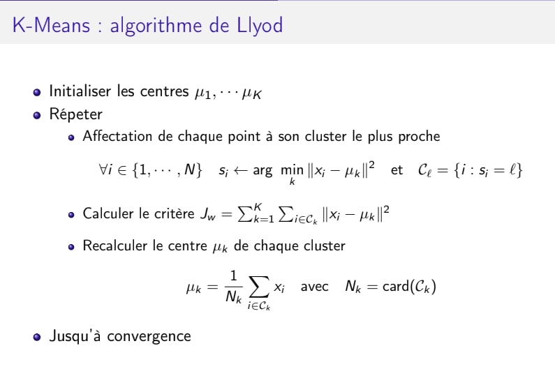
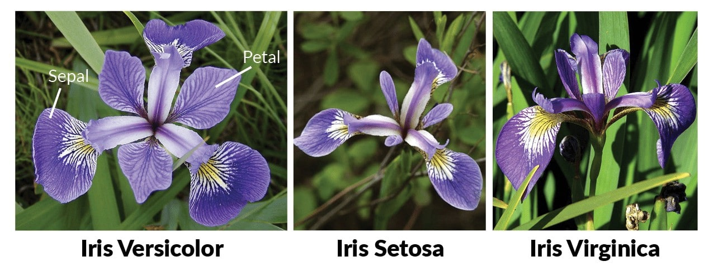
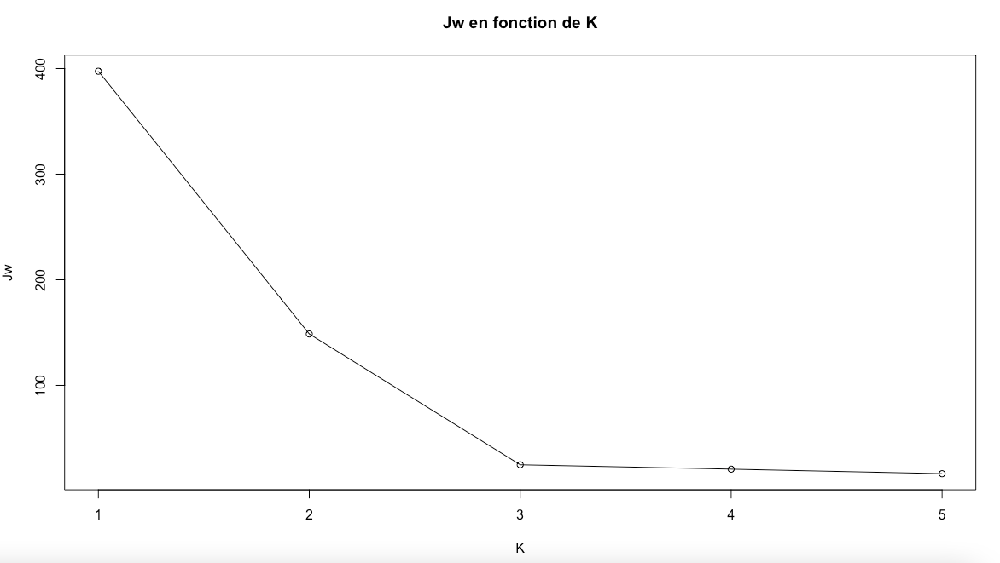

### Tirage des données / Générer les mélanges gaussiens avec les paramètres donnés par l'utilisateur


```{r}
library(mvtnorm)
library(ggplot2)
library(gridExtra)
library(corrplot)
library(dplyr)
```

#### On définit une fonction melange_gaussien qui génère les données (mélanges gaussiens) permettant d'illustrer K-Means.

```{r}
melange_gaussien = function(n, p, mu, sigma){
  nb = length(p)     # nombre de mélanges gaussiennes 
  y <- sample(1:nb,size=n,prob=p,replace=TRUE)       
  vec <-  sapply(1:nb,function(i){ return (sum(y==i))})     # vec contient le nombre de points qu'on doit tirer pour chaque composante du mélange gaussien 
  Sigma <- diag(c(sigma,sigma))     # matrice de covariance 
  df <-  rmvnorm(vec[1],mu[1:2],Sigma)      
  for(i in 2:nb){
    pos1 <-  2*i - 1              
    pos2 <-  2*i
    df <-  rbind(df ,rmvnorm(vec[i],mu[pos1:pos2],Sigma))       
  }
  colnames(df) <- c("x","y") 
  return (data.frame(df))
}
```

```{r}
set.seed(10)
n <- 1000                  # nombre de données
K <- 3                     # nombre de clusters
NiterMax <- 10                      # itération maximale pour arrêter l'algorithme de K-Means
p1 <- 0.3; p2 <- 0.4; p3 <- 0.3                             # vecteur de proportions
mu1 <- c(0.5,4); mu2 <- c(2.5,1); mu3 <- c(0,0.1)           # vecteur de moyennes 
p <-  c(p1, p2, p3)
mu <-  c(mu1, mu2, mu3)
sigma <-  0.1

data <-  melange_gaussien(n, p, mu, sigma)
ggplot(data,aes(x =  x,y =  y)) + geom_point() + labs(title =  "Données des mélanges gaussiens") +
  theme(legend.position = "bottom" , plot.title = element_text(hjust = 0.5 , size=20)) 
```


<br>

#### L’algorithme des K-means (K-moyennes) est un algorithme non supervisé très connu en matière de Clustering. Cet algorithme a été conçu en 1957 au sein des Laboratoires Bell par Stuart P.Lloyd comme technique de modulation par impulsion et codage(MIC).

<br>



<br>

#### Le clustering consiste à regrouper selon un critère de similarité, une grande quantité de données en plusieurs sous-ensembles appelés clusters. Les éléments contenus dans un cluster sont similaires les uns aux autres, mais différents des éléments des autres clusters.

<br>



<br>

#### L’idée est assez simple et intuitive. La première étape consiste à définir K centroïdes aléatoirement auxquels on associe K étiquettes. Ensuite pour chaque point, on calcule leur distance euclidienne aux K centroïdes et on associe le point au centroïde le plus proche et l’étiquette correspondante. Puis on recalcule K nouveaux centroïdes à partir des points rattachés. On répète ces étapes jusqu’à ce que les nouveaux centroïdes ne bougent plus des précédents.

<br>



<br>

### Initialisation : choisir les centroides c'est à dire choisir K points aléatoirement

```{r}
create_centroids <- function(K,data){
  df <- data[sample(1:nrow(data),K),]      # choisir K points aléatoirement avec sample
  df <- cbind(df,1:K)                      # ajouter une colonne qui contient le numéro de centroides
  df <- data.frame(df)
  colnames(df) <- c("x1", "y1", "n_centroid")
  return(df)
}
```


```{r}
set.seed(10)
centroids <- create_centroids(K,data)
plot_list <- list()      # une liste pour stocker tous les plots
plot_1 = ggplot() + 
  geom_point(aes(x,y, col = "bleu", size = 1), data = data) + 
  geom_point(aes(x1,y1), data = centroids, size = 10, shape=21) +
  labs(title = paste("Illustration de K-means : Initialisation")) +
  geom_text(aes(x1,y1, label = n_centroid), data = centroids, col = "black") +
  theme_minimal() + theme(legend.position = "bottom" , plot.title = element_text(hjust = 0.5 , size=12)) + guides(size = "none") 
plot_list[[1]] = plot_1
plot_list[[1]]
```

### Distance euclidienne

```{r}
euclidean_distance_carre <- function(p1, p2){
  return (sum((p1 - p2)^2))
}
```

### Première attribution de chaque point à un cluster plus proche

```{r}
premiere_attribution <- function(data, centroids){
  data$cluster <- NA     # on définit une nouvelle colonne pour stocker l'étiquette correspondante
  data$error <- NA       # pour stocker l'erreur entre le point et le centroïde le plus proche
  for(i in 1:length(data$x)){
    # on calcule la distance euclidienne de chaque point aux K centroïdes
    x <- unlist(sapply(1:K , function(j){ return (euclidean_distance_carre(centroids[j,1:2], data[i,1:2])) }))
    data$cluster[i] <- which.min(x)    # on associe chaque point au centroïde le plus proche et l’étiquette correspondante
    data$error[i] <- min(x)              # l'erreur entre chaque point et le centroïde le plus proche 
  }
  return (data)
}
```


```{r}
data <- premiere_attribution(data, centroids)
plot_2 <- ggplot() + 
  geom_point(aes(x,y, col = as.factor(cluster), size = 5), data = data) + 
  geom_point(aes(x1,y1), data = centroids, size = 10, shape=21) +
  labs(title = paste("Illustration de K-means : 1ère attribution")) +
  geom_text(aes(x1,y1, label = n_centroid), data = centroids, col = "black") +
  theme_minimal() + theme(legend.position = "bottom" , plot.title = element_text(hjust = 0.5 , size=12)) + guides(size = "none") 
plot_list[[2]] = plot_2
plot_list[[2]]
```


### Calcul de moyennes / barycentres

```{r}
mean_by_cluster_bis <- function(data,K){
      centroids <- data %>%         # on utilise la fonction group_by de la bibliothèque dplyr pour calculer la moyenne des points dans chaque cluster.
        group_by(cluster) %>%       
        summarize(
          x = mean(x), 
          y = mean(y)
        ) 
      centroids <- data.frame(centroids)[,c(2,3,1)]    # pour ordonner les colonnes comme on le souhaite
      colnames(centroids) <- c("x1", "y1", "n_centroid")
      return (centroids)
}

# Voici une autre version de la fonction mean_by_cluster 
mean_by_cluster <- function(data,K){
  x <- rep(0,K)
  y <- rep(0,K)
  for(i in 1:length(data$cluster)){
    for(k in 1:K){
      if(data$cluster[i] == k){
        x[k] <- x[k] + data$x[i]      # la somme de 1ère composante qui est dans le cluster k
        y[k] <- y[k] + data$y[i]      # la somme de 2ème composante qui est dans le cluster k
      }
    }
  }
  nb <- table(data$cluster)       # nombre de points dans chaque cluster
  df <- data.frame(x <- x/nb, y <- y/nb)
  new_df <- cbind(df[c(2,4)],1:K)     # seulement les colonnes 2 et 4 contiennt les valeurs 
  colnames(new_df) <- c("x1", "y1", "n_centroid")
  return (new_df)
}
plot_3 <- ggplot() + 
  geom_point(aes(x,y, col = as.factor(cluster), size = 7), data = data) + 
  geom_point(aes(x1,y1), data = mean_by_cluster(data, K), size = 10, shape=21) +
  labs(title = paste("Illustration de K-means : 1ère itération")) +
  geom_text(aes(x1,y1, label = n_centroid), data = mean_by_cluster(data, K), col = "black") +
  theme_minimal() + theme(legend.position = "bottom" , plot.title = element_text(hjust = 0.5 , size=12)) + guides(size = "none") 
plot_list[[3]] = plot_3
plot_list[[3]]
```

### On répète ces étapes jusqu’à la convergence des centroïdes 

```{r}
attribution = function(data, centroids, K, NiterMax, plot_list){
  iter = 0             # nombre d'itérations 
  erreur_old = 0
  erreur_new = sum(data$error)        # erreur Jw qui est dans l'algorithme de K-Means
  centroids <- mean_by_cluster(data, K)     # on recalcule les nouveaux centroides
  while( erreur_old != erreur_new && (iter <= NiterMax ) ){
    # On repète l'algo tant que les centroides bougent et le nombre d'itératon maximale n'est pas été dépassé.
    for(i in 1:length(data$x)){
      x = unlist(sapply(1:K , function(j){ return (euclidean_distance_carre(centroids[j,1:2], data[i,1:2])) }))
      data$error[i] = min(x)
      data$cluster[i] = which.min(x)
    }
    erreur_old   = erreur_new 
    erreur_new = sum(data$error)
    centroids <- mean_by_cluster(data,K)
    plot_list[[(iter+4)]] = ggplot(data = data) + 
    geom_point(aes(x,y, col = as.factor(cluster), size = 7)) + 
    geom_point(aes(x1,y1), data = centroids, size = 10, shape=21) +
    labs(title = paste("Illustration de K-means : " , iter + 2 , "e itération")) +
    geom_text(aes(x1,y1, label = n_centroid), data = centroids, col = "black") +
    theme_minimal() + theme(legend.position = "bottom" , plot.title = element_text(hjust = 0.5 , size=12)) + guides(size = "none")
    iter = iter + 1
  }
  # On renvoie le nombre d'itéraion finale, une liste qui contient tous les plots, les données et les centroides 
  return (c((iter - 1),plot_list,data,centroids))
}
```


```{r}
tab = attribution(data, centroids, K, NiterMax, plot_list)
iter = tab[[1]]
data = data.frame(x = tab$x, y = tab$y, cluster = tab$cluster)
centroids = data.frame(x1 = tab$x1, y1 = tab$y1, n_centroid = tab$n_centroid)

ggplot() + 
  geom_point(aes(x,y, col = as.factor(cluster), size = 7), data = data) + 
  geom_point(aes(x1,y1), data = centroids, size = 10, shape=21) +
  labs(title = paste("Illustration de K-means avec convergence en " , iter , " itérations")) +
  geom_text(aes(x1,y1, label = n_centroid), data = centroids, col = "black") +
  theme_minimal() + theme(legend.position = "bottom" , plot.title = element_text(hjust = 0.5 , size=12)) + guides(size = "none") 
```


## Illustration de K-Means itérartion par itération

```{r}
grid.arrange(tab[[2]], tab[[3]], ncol=2, nrow = 1)
```
```{r}
grid.arrange(tab[[4]], tab[[5]], ncol=2, nrow = 1)
```
```{r}
grid.arrange(tab[[6]], tab[[7]], ncol=2, nrow = 1)
```
```{r}
grid.arrange(tab[[8]], tab[[9]], ncol=2, nrow = 1)
```


#### Dans ce cas, on voit bien que l'algorithme de K-Means converge vers une solution optimale.

```{r}
set.seed(10)
n <- 100                  # nombre de données
K <- 3                     # nombre de clusters
NiterMax <- 10                      # itération maximale pour arrêter l'algorithme de K-Means
p1 <- 0.3; p2 <- 0.4; p3 <- 0.3                             # vecteur de proportions
mu1 <- c(0.5,4); mu2 <- c(5,1); mu3 <- c(0,0.1)           # vecteur de moyennes 
p <-  c(p1, p2, p3)
mu <-  c(mu1, mu2, mu3)
sigma <-  0.2

data <-  melange_gaussien(n, p, mu, sigma)
```


```{r}
# Test de la convergence de K-Means avec des inialisations différentes.
set.seed(7)
centroids <- create_centroids(K,data)
plot_list <- list()      # une liste pour stocker tous les plots
plot_1 = ggplot() + 
  geom_point(aes(x,y, col = "bleu", size = 1), data = data) + 
  geom_point(aes(x1,y1), data = centroids, size = 10, shape=21) +
  labs(title = paste("Illustration de K-means : Initialisation")) +
  geom_text(aes(x1,y1, label = n_centroid), data = centroids, col = "black") +
  theme_minimal() + theme(legend.position = "bottom" , plot.title = element_text(hjust = 0.5 , size=12)) + guides(size = "none") 
plot_list[[1]] = plot_1

data <- premiere_attribution(data, centroids)
plot_list_bis <- list()      # une liste pour stocker tous les plots
plot_1 <- ggplot() + 
  geom_point(aes(x,y, col = as.factor(cluster), size = 5), data = data) + 
  geom_point(aes(x1,y1), data = centroids, size = 10, shape=21) +
  labs(title = paste("Illustration de K-means : 1er itération")) +
  geom_text(aes(x1,y1, label = n_centroid), data = centroids, col = "black") +
  theme_minimal() + theme(legend.position = "bottom" , plot.title = element_text(hjust = 0.5 , size=12)) + guides(size = "none") 
plot_list_bis[[1]] = plot_1

data <- premiere_attribution(data, centroids)
plot_2 <- ggplot() + 
  geom_point(aes(x,y, col = as.factor(cluster), size = 5), data = data) + 
  geom_point(aes(x1,y1), data = centroids, size = 10, shape=21) +
  labs(title = paste("Illustration de K-means : 1ère attribution")) +
  geom_text(aes(x1,y1, label = n_centroid), data = centroids, col = "black") +
  theme_minimal() + theme(legend.position = "bottom" , plot.title = element_text(hjust = 0.5 , size=12)) + guides(size = "none") 
plot_list[[2]] = plot_2

plot_3 <- ggplot() + 
  geom_point(aes(x,y, col = as.factor(cluster), size = 7), data = data) + 
  geom_point(aes(x1,y1), data = mean_by_cluster(data, K), size = 10, shape=21) +
  labs(title = paste("Illustration de K-means : 1ère itération")) +
  geom_text(aes(x1,y1, label = n_centroid), data = mean_by_cluster(data, K), col = "black") +
  theme_minimal() + theme(legend.position = "bottom" , plot.title = element_text(hjust = 0.5 , size=12)) + guides(size = "none") 
plot_list[[3]] = plot_3

tab = attribution(data, centroids, K, NiterMax, plot_list)
iter = tab[[1]]
data = data.frame(x = tab$x, y = tab$y, cluster = tab$cluster)
centroids = data.frame(x1 = tab$x1, y1 = tab$y1, n_centroid = tab$n_centroid)

ggplot() + 
  geom_point(aes(x,y, col = as.factor(cluster), size = 7), data = data) + 
  geom_point(aes(x1,y1), data = centroids, size = 10, shape=21) +
  labs(title = paste("Illustration de K-means avec convergence en " , iter , " itérations")) +
  geom_text(aes(x1,y1, label = n_centroid), data = centroids, col = "black") +
  theme_minimal() + theme(legend.position = "bottom" , plot.title = element_text(hjust = 0.5 , size=12)) + guides(size = "none") 

```

```{r}
grid.arrange(tab[[2]], tab[[3]], ncol=2, nrow = 1)
```

```{r}
grid.arrange(tab[[4]], tab[[5]], ncol=2, nrow = 1)
```
```{r}
grid.arrange(tab[[6]], tab[[7]], ncol=2, nrow = 1)
```

```{r}
grid.arrange(tab[[8]], tab[[9]], ncol=2, nrow = 1)
```
```{r}
grid.arrange(tab[[10]], tab[[11]], ncol=2, nrow = 1)
```
```{r}
grid.arrange(tab[[12]], ncol=1, nrow = 1)
```


#### Ici, l'algorithme de K-Means converge vers une solution locale mais pas une solution optimale. 
#### Un inconvénient de cet algorithme de K-means est qu'il est sensible à l'initialisation des centroïdes. Pour surmonter cela, nous utilisons K-means++. Cet algorithme assure une initialisation plus intelligente des centroïdes et améliore la qualité du clustering. Hormis l'initialisation, le reste de l'algorithme est identique à l'algorithme K-means standard.

## K-Means ++

#### Voici l’algorithme de K-Means ++ : 
     1) Sélectionnez au hasard le premier centroide à partir des points de données.
     2) Pour chaque point, calculez sa distance par rapport au centroïde le plus proche précédemment choisi.
     3) Sélectionnez le centroïde suivant à partir des points de données de sorte que la probabilité de choisir un point comme centroïde soit directement proportionnelle à sa distance par rapport au centroïde le plus proche précédemment choisi. (c'est-à-dire que le point ayant la distance maximale du centroïde le plus proche est le plus susceptible d'être sélectionné ensuite comme centroïde).
     4) Répétez les étapes 2 et 3 jusqu'à ce que k centroïdes aient été échantillonnés.


```{r}
create_centroids_advance <- function(K,data){
  df <- data[sample(1:nrow(data),1),]      # choisir un point aléatoire dans l'ensemble de données
  for(s in 1:(K-1)){
    tab <- c()
    for(i in 1:length(data$x)){
      # on calcule pour chaque point la distance euclidienne par rapport au centroïde le plus proche précédemment choisi
      x <- unlist(sapply(1:s , function(j){ return (euclidean_distance_carre(df[j,1:2], data[i,1:2])) }))
      m <- min(x)
      tab <- c(tab,m)
    }
    p <- which.max(tab)   # on stocke dans tab le point ayant la distance maximale du centroïde le plus proche
    df <- rbind(df,data[p,])
  }
  df <- df[,1:2]
  df <- cbind(df,1:K)
  df <- data.frame(df)
  colnames(df) <- c("x1", "y1", "n_centroid")
  return(df)
}
```


```{r}
# Test de la convergence de K-Means++ 
set.seed(7)
centroids <- create_centroids_advance(K,data)
plot_list <- list()      # une liste pour stocker tous les plots
plot_1 = ggplot() + 
  geom_point(aes(x,y, col = "bleu", size = 1), data = data) + 
  geom_point(aes(x1,y1), data = centroids, size = 10, shape=21) +
  labs(title = paste("Illustration de K-means : Initialisation")) +
  geom_text(aes(x1,y1, label = n_centroid), data = centroids, col = "black") +
  theme_minimal() + theme(legend.position = "bottom" , plot.title = element_text(hjust = 0.5 , size=12)) + guides(size = "none") 
plot_list[[1]] = plot_1


data <- premiere_attribution(data, centroids)
plot_2 <- ggplot() + 
  geom_point(aes(x,y, col = as.factor(cluster), size = 5), data = data) + 
  geom_point(aes(x1,y1), data = centroids, size = 10, shape=21) +
  labs(title = paste("Illustration de K-means : 1ère attribution")) +
  geom_text(aes(x1,y1, label = n_centroid), data = centroids, col = "black") +
  theme_minimal() + theme(legend.position = "bottom" , plot.title = element_text(hjust = 0.5 , size=12)) + guides(size = "none") 
plot_list[[2]] = plot_2

plot_3 <- ggplot() + 
  geom_point(aes(x,y, col = as.factor(cluster), size = 7), data = data) + 
  geom_point(aes(x1,y1), data = mean_by_cluster(data, K), size = 10, shape=21) +
  labs(title = paste("Illustration de K-means : 1ère itération")) +
  geom_text(aes(x1,y1, label = n_centroid), data = mean_by_cluster(data, K), col = "black") +
  theme_minimal() + theme(legend.position = "bottom" , plot.title = element_text(hjust = 0.5 , size=12)) + guides(size = "none") 
plot_list[[3]] = plot_3

tab = attribution(data, centroids, K, NiterMax, plot_list)
iter = tab[[1]]
data = data.frame(x = tab$x, y = tab$y, cluster = tab$cluster)
centroids = data.frame(x1 = tab$x1, y1 = tab$y1, n_centroid = tab$n_centroid)

ggplot() + 
  geom_point(aes(x,y, col = as.factor(cluster), size = 7), data = data) + 
  geom_point(aes(x1,y1), data = centroids, size = 10, shape=21) +
  labs(title = paste("Illustration de K-means avec convergence en " , iter , " itérations")) +
  geom_text(aes(x1,y1, label = n_centroid), data = centroids, col = "black") +
  theme_minimal() + theme(legend.position = "bottom" , plot.title = element_text(hjust = 0.5 , size=12)) + guides(size = "none") 
```

```{r}
grid.arrange(tab[[2]], tab[[3]], ncol=2, nrow = 1)
```

```{r}
grid.arrange(tab[[4]], ncol=1, nrow = 1)
```


#### L’algorithme de K-Means++ converge souvent en quelques itérations (à chaque itération le critère Jw diminue comme dans l'algorithme de K-Means).


#### Il est facile de mettre en œuvre l’algorithme de k- means et d'identifier des groupes de données inconnus à partir d'ensembles de données complexes. K-means convient à un grand nombre d'ensembles de données. Cela peut également fonctionner pour les clusters supérieurs. La segmentation K-means est linéaire dans le nombre de données Par rapport d'autres méthodes de clustering, c'est une technique de clustering qui est rapide et efficace en termes de coût de calcul O(K*N*l*d) avec N nombre de points, d nombre d’attributs (d = 2 ici), K nombre de clusters et l le nombre d’itérations.


#### Ensemble de clusters non optimal : K-means ne permet pas le développement d'un ensemble optimal de clusters et pour des résultats efficaces, vous devez choisir les clusters avant. Le clustering K-means donne des résultats variables sur différentes exécutions d'un algorithme. Un choix aléatoire de modèles de cluster donne des résultats de clustering différents, ce qui entraîne une incohérence. L'algorithme K-means ne peut être exécuté que sur des données numériques. vous devez spécifier le nombre de clusters (K) au début de l'algorithme.


## Application de K-Means sur des données réelles : IRIS


#### L'ensemble de données se compose de 50 échantillons de chacune des trois espèces d'Iris (Iris setosa, Iris virginica et Iris versicolor). Quatre caractéristiques ont été mesurées sur chaque échantillon : la longueur et la largeur des sépales et des pétales, en centimètres.




```{r}
data = iris[,1:4]
corrplot(cor(data), method = "number", type = "upper")
```

#### On voit une forte corrélation entre la largeur des sépales et des pétales.

```{r}
# Illustration de K-Means sur Iris
set.seed(0)
data <- iris[,3:4]
data = data.frame(data)
colnames(data) <- c("x","y") 
K <- 3                     
NiterMax <- 10 
centroids <- create_centroids(K,data)
data <- premiere_attribution(data, centroids)

tab = attribution(data, centroids, K, NiterMax, plot_list)
iter = tab[[1]]
data = data.frame(x = tab$x, y = tab$y, cluster = tab$cluster)
centroids = data.frame(x1 = tab$x1, y1 = tab$y1, n_centroid = tab$n_centroid)

ggplot() + 
  geom_point(aes(x,y, col = as.factor(cluster), size = 7), data = data) + 
  geom_point(aes(x1,y1), data = centroids, size = 10, shape=21) +
  labs(title = paste("Illustration de K-means avec convergence en " , iter , " itérations")) +
  geom_text(aes(x1,y1, label = n_centroid), data = centroids, col = "black") +
  theme_minimal() + theme(legend.position = "bottom" , plot.title = element_text(hjust = 0.5 , size=12)) + guides(size = "none")

```

#### Ici, l'algorithme de K-Means converge vers une solution optimale.

```{r}
# Illustration de K-Means sur des données de la forme d'une ellipse.
set.seed(0)
n <- 500
theta <- runif(n, min = 0, max = 2*pi)    # loi uniforme sur [0,2*pi]
r = 2
# génération d'une ellipse de rayon 2 avec des bruits gaussiens
v1 <- r * cos(theta) + rnorm(n,0,0.1)     
v2 <- r * sin(theta) + rnorm(n,0,0.1)
data <- data.frame(x = v1, y = v2)  

nb <- 100
mu <-  c(0,0)
sigma <-  0.2
Sigma <- diag(c(sigma,sigma)) 
# On rajoute un mélange gaussien au centre de l'ellipse
df <-  rmvnorm(nb,mu,Sigma) 
colnames(df) <- c("x", "y")
data = rbind(data,df)
ggplot(data,aes(x =  x,y =  y)) + geom_point() + labs(title <-  "Data")
```

```{r}
# Illustration de K-Means sur des données de la forme d'une ellipse avec K = 3
set.seed(0)
K <- 3                     
NiterMax <- 10 
centroids <- create_centroids(K,data)
data <- premiere_attribution(data, centroids)

tab = attribution(data, centroids, K, NiterMax, plot_list)
iter = tab[[1]]
data = data.frame(x = tab$x, y = tab$y, cluster = tab$cluster)
centroids = data.frame(x1 = tab$x1, y1 = tab$y1, n_centroid = tab$n_centroid)

ggplot() + 
  geom_point(aes(x,y, col = as.factor(cluster), size = 7), data = data) + 
  geom_point(aes(x1,y1), data = centroids, size = 10, shape=21) +
  labs(title = paste("Illustration de K-means avec convergence en " , iter , " itérations")) +
  geom_text(aes(x1,y1, label = n_centroid), data = centroids, col = "black") +
  theme_minimal() + theme(legend.position = "bottom" , plot.title = element_text(hjust = 0.5 , size=12)) + guides(size = "none")
```

```{r}
# Illustration de K-Means sur des données de la forme d'une ellipse avec K = 2
set.seed(0)
K <- 2                    
NiterMax <- 10 
centroids <- create_centroids(K,data)
data <- premiere_attribution(data, centroids)

tab = attribution(data, centroids, K, NiterMax, plot_list)
iter = tab[[1]]
data = data.frame(x = tab$x, y = tab$y, cluster = tab$cluster)
centroids = data.frame(x1 = tab$x1, y1 = tab$y1, n_centroid = tab$n_centroid)

ggplot() + 
  geom_point(aes(x,y, col = as.factor(cluster), size = 7), data = data) + 
  geom_point(aes(x1,y1), data = centroids, size = 10, shape=21) +
  labs(title = paste("Illustration de K-means avec convergence en " , iter , " itérations")) +
  geom_text(aes(x1,y1, label = n_centroid), data = centroids, col = "black") +
  theme_minimal() + theme(legend.position = "bottom" , plot.title = element_text(hjust = 0.5 , size=12)) + guides(size = "none")
```


```{r}
# Illustration de K-Means sur des données de la forme d'une ellipse avec K = 10
set.seed(0)
K <- 10                   
NiterMax <- 10 
centroids <- create_centroids(K,data)
data <- premiere_attribution(data, centroids)

tab = attribution(data, centroids, K, NiterMax, plot_list)
iter = tab[[1]]
data = data.frame(x = tab$x, y = tab$y, cluster = tab$cluster)
centroids = data.frame(x1 = tab$x1, y1 = tab$y1, n_centroid = tab$n_centroid)

ggplot() + 
  geom_point(aes(x,y, col = as.factor(cluster), size = 7), data = data) + 
  geom_point(aes(x1,y1), data = centroids, size = 10, shape=21) +
  labs(title = paste("Illustration de K-means avec convergence en " , iter , " itérations")) +
  geom_text(aes(x1,y1, label = n_centroid), data = centroids, col = "black") +
  theme_minimal() + theme(legend.position = "bottom" , plot.title = element_text(hjust = 0.5 , size=12)) + guides(size = "none")
```

<br>

#### On remarque que l'algorithme de K-Means n'est adapté pour ce genre de problème. Pour K = 2, on s'attendait à ce que le premier cluster abrite les données de l'ellipse tandis que le deuxième les données du mélange gaussien. Alors que cet algorithme répartie les données selon une droite. Pour K = 10, les données générés par le mélange gaussien occupe un cluster tandis que les données de l'ellpise se divise en 9 autres clusters. En général, les jeux de données avec des formes elliptiques par exemple poseront problème.

<br>

#### On remarque la différence des solutions finales à chaque initialisation. K-means donne des résultats variables sur différentes exécutions d'un algorithme. Un choix aléatoire de modèles de clusters produit différents résultats, ce qui entraîne une incohérence. Ici, on a fixé la graine pour ne pas avoir le changement à chaque lancé. Donc, une initialisation différente peut mener à une solution non optimale.

<br>

#### Le problème qui se pose est de trouver un K optimal. L’une des méthodes les plus populaires pour y arriver est la méthode d’Elbow. L’idée est d’exécuter K-means pour une gamme de clusters K (disons de 1 à 10) et pour chaque valeur, nous calculons l’inertie intraclasse. Lorsque l’on trace et que le tracé ressemble à un bras, le «coude» (le point d’inflexion de la courbe) est la meilleure valeur de K.


```{r}
# On définit une fonction KMeans qui prend en argument data, le nombre de clusters K, le nombre d'itération maximale NiterMax et un booléen advance qui indique l'utilisation de K-Means++ et renvoie le nombre d'itération pour atteindre la convergence de centroides, l'erreur finale Jw , un data frame avec les étiquettes et les centroides.
KMeans <- function(data,K,NiterMax,advance = FALSE){
  if(advance){
    centroids <- create_centroids_advance(K, data)
  }
  else{
  centroids <- create_centroids(K, data)
  }
  data$cluster <- NA
  data$error <- NA
  iter <- 0
  erreur_old <- 0
  found <- FALSE
  while( (found == FALSE) && (iter < NiterMax ) ){
    for(i in 1:length(data$x)){
      x <- unlist(sapply(1:K , function(j){ return (euclidean_distance_carre(centroids[j,1:2], data[i,1:2])) }))
      data$error[i] <- min(x)
      data$cluster[i] <- which.min(x)
    }
    erreur_new <- sum(data$error)
    found <- erreur_new == erreur_old
    erreur_old   <- erreur_new 
    centroids <- mean_by_cluster(data,K)
    if(!found){
      iter <- iter + 1
    }
  }
  return (c(iter,erreur_new,data,centroids))
}
```


```{r}
# Avec les données générées avant, on peut afficher l'erreur en fonction de K, On met cette partie en commentaire pour ne pas lancer plusieur fois.
#erreur = c()
#for(K in 1:5){
#  tab = KMeans(data,K,10,advance = TRUE)
#  erreur = c(erreur,tab[[2]])
#}
#plot(NA,NA,xlim=c(1,K),ylim=c(erreur[K],erreur[1]),main = "Jw en fonction de K",xlab = "K", ylab = "Jw")
#points(1:K,erreur)
#lines(1:K,erreur)
```

<br>



<br>

#### Avec la méthode d’Elbow, on voit facilement que le nombre de clusters optimal est 3.